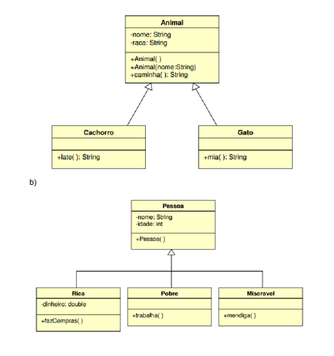

# Herança

Exercício 1: Implemente a classe Funcionário com os atributos: nome, salário
e os métodos:
● addAumento(double valor)
● ganhoAnual()
● exibeDados() - imprime os valores do funcionário.

```java
// Source code is decompiled from a .class file using FernFlower decompiler.
package heranca;

public class Funcionario {
   private String nome;
   private double salario;

   public Funcionario(String nome, double salario) {
      this.nome = nome;
      this.salario = salario;
   }

   public void addAumento(double valor) {
      this.salario += valor;
   }

   public double ganhoAnual() {
      return this.salario * 12.0;
   }

   public void exibeDados() {
      System.out.println("Nome: " + this.nome);
      System.out.println("Sal\u00e1rio: " + this.salario);
      System.out.println("Ganho Anual: " + this.ganhoAnual());
   }

   public String getNome() {
      return this.nome;
   }

   public void setNome(String nome) {
      this.nome = nome;
   }

   public double getSalario() {
      return this.salario;
   }

   public void setSalario(double salario) {
      this.salario = salario;
   }
}

```

```java
// Source code is decompiled from a .class file using FernFlower decompiler.
package heranca;

public class FuncionarioTeste {
   public FuncionarioTeste() {
   }

   public static void main(String[] args) {
      Funcionario funcionario = new Funcionario("Jo\u00e3o", 3000.0);
      funcionario.addAumento(500.0);
      funcionario.exibeDados();
      System.out.println("-----");
      Tecnico tecnico = new Tecnico("Maria", 4000.0, "T123", 1000.0);
      tecnico.exibeDados();
      System.out.println("-----");
      Administrativo administrativo = new Administrativo("Carlos", 3500.0, "A456", "noite", 500.0);
      administrativo.exibeDados();
      System.out.println("-----");
      Administrativo administrativoDia = new Administrativo("Ana", 3500.0, "A789", "dia", 500.0);
      administrativoDia.exibeDados();
   }
}

```

a. crie a classe Assistente, que também é um funcionário, e que possui um
número de matrícula (faça os métodos GET e SET).
Sobrescreva o método exibeDados().

```java
// Source code is decompiled from a .class file using FernFlower decompiler.
package heranca;

public class Assistente extends Funcionario {
   private String numeroMatricula;

   public Assistente(String nome, double salario, String numeroMatricula) {
      super(nome, salario);
      this.numeroMatricula = numeroMatricula;
   }

   public String getNumeroMatricula() {
      return this.numeroMatricula;
   }

   public void setNumeroMatricula(String numeroMatricula) {
      this.numeroMatricula = numeroMatricula;
   }

   public void exibeDados() {
      super.exibeDados();
      System.out.println("N\u00famero de Matr\u00edcula: " + this.numeroMatricula);
   }
}

```

b. sabendo que os Assistentes Técnicos possuem um bônus salarial e que os
Assistentes Administrativos possuem um turno (dia ou noite) e um adicional
noturno, crie as classes Técnico e Administrativo e sobrescreva o método
ganhoAnual() de ambas as classes (Administrativo e Técnico)

```java
// Source code is decompiled from a .class file using FernFlower decompiler.
package heranca;

public class Tecnico extends Assistente {
   private double bonusSalarial;

   public Tecnico(String nome, double salario, String numeroMatricula, double bonusSalarial) {
      super(nome, salario, numeroMatricula);
      this.bonusSalarial = bonusSalarial;
   }

   public double getBonusSalarial() {
      return this.bonusSalarial;
   }

   public void setBonusSalarial(double bonusSalarial) {
      this.bonusSalarial = bonusSalarial;
   }

   public double ganhoAnual() {
      return this.getSalario() * 12.0 + this.bonusSalarial;
   }

   public void exibeDados() {
      super.exibeDados();
      System.out.println("B\u00f4nus Salarial: " + this.bonusSalarial);
   }
}

```

```java
// Source code is decompiled from a .class file using FernFlower decompiler.
package heranca;

public class Administrativo extends Assistente {
   private String turno;
   private double adicionalNoturno;

   public Administrativo(String nome, double salario, String numeroMatricula, String turno, double adicionalNoturno) {
      super(nome, salario, numeroMatricula);
      this.turno = turno;
      this.adicionalNoturno = adicionalNoturno;
   }

   public String getTurno() {
      return this.turno;
   }

   public void setTurno(String turno) {
      this.turno = turno;
   }

   public double getAdicionalNoturno() {
      return this.adicionalNoturno;
   }

   public void setAdicionalNoturno(double adicionalNoturno) {
      this.adicionalNoturno = adicionalNoturno;
   }

   public double ganhoAnual() {
      double salarioAnual = this.getSalario() * 12.0;
      if ("noite".equalsIgnoreCase(this.turno)) {
         salarioAnual += this.adicionalNoturno;
      }

      return salarioAnual;
   }

   public void exibeDados() {
      super.exibeDados();
      System.out.println("Turno: " + this.turno);
      if ("noite".equalsIgnoreCase(this.turno)) {
         System.out.println("Adicional Noturno: " + this.adicionalNoturno);
      }

   }
}

```

Exercício 2: Implemente os diagramas de classe abaixo:
a) 

- **Classe Animal:** A classe base que define as características comuns a todos os animais.
- **Classe Cachorro:** Herda de `Animal` e adiciona o método específico `late`.
- **Classe Gato:** Herda de `Animal` e adiciona o método específico `mia`.

```java
// Source code is decompiled from a .class file using FernFlower decompiler.
package heranca;

public class Animal {
   private String nome;
   private String raca;

   public Animal() {
   }

   public Animal(String nome) {
      this.nome = nome;
   }

   public String caminha() {
      return this.nome + " est\u00e1 caminhando.";
   }

   public String getNome() {
      return this.nome;
   }

   public void setNome(String nome) {
      this.nome = nome;
   }

   public String getRaca() {
      return this.raca;
   }

   public void setRaca(String raca) {
      this.raca = raca;
   }
}

```

```java
// Source code is decompiled from a .class file using FernFlower decompiler.
package heranca;

public class AnimalTeste {
   public AnimalTeste() {
   }

   public static void main(String[] args) {
      Cachorro cachorro = new Cachorro();
      cachorro.setNome("Rex");
      System.out.println(cachorro.caminha());
      System.out.println(cachorro.late());
      Gato gato = new Gato();
      gato.setNome("Mia");
      System.out.println(gato.caminha());
      System.out.println(gato.mia());
   }
}

```

```java
// Source code is decompiled from a .class file using FernFlower decompiler.
package heranca;

public class Cachorro extends Animal {
   public Cachorro() {
   }

   public String late() {
      return "O cachorro est\u00e1 latindo!";
   }
}

```

```java
// Source code is decompiled from a .class file using FernFlower decompiler.
package heranca;

public class Gato extends Animal {
   public Gato() {
   }

   public String mia() {
      return "O gato est\u00e1 miando!";
   }
}

```

Class Pessoa:

```java
// Source code is decompiled from a .class file using FernFlower decompiler.
package heranca;

public class Pessoa {
   private String nome;
   private int idade;

   public Pessoa() {
   }

   public Pessoa(String nome, int idade) {
      this.nome = nome;
      this.idade = idade;
   }

   public String getNome() {
      return this.nome;
   }

   public void setNome(String nome) {
      this.nome = nome;
   }

   public int getIdade() {
      return this.idade;
   }

   public void setIdade(int idade) {
      this.idade = idade;
   }
}

```

```java
// Source code is decompiled from a .class file using FernFlower decompiler.
package heranca;

import java.io.PrintStream;

public class PessoaTeste {
   public PessoaTeste() {
   }

   public static void main(String[] args) {
      Rica rica = new Rica("Jo\u00e3o", 30, 10000.0);
      PrintStream var10000 = System.out;
      String var10001 = rica.getNome();
      var10000.println(var10001 + ", idade: " + rica.getIdade() + " - Rica");
      System.out.println("Faz compras!");
      Pobre pobre = new Pobre("Maria", 40);
      var10000 = System.out;
      var10001 = pobre.getNome();
      var10000.println(var10001 + ", idade: " + pobre.getIdade() + " - Pobre");
      System.out.println("Trabalha!");
      Miseravel miseravel = new Miseravel("Jos\u00e9", 50);
      var10000 = System.out;
      var10001 = miseravel.getNome();
      var10000.println(var10001 + ", idade: " + miseravel.getIdade() + " - Miser\u00e1vel");
      System.out.println("Mendiga!");
   }
}

```

```java
// Source code is decompiled from a .class file using FernFlower decompiler.
package heranca;

public class Rica extends Pessoa {
   private double dinheiro;

   public Rica(String nome, int idade, double dinheiro) {
      super(nome, idade);
      this.dinheiro = dinheiro;
   }

   public String fazCompras() {
      return "A pessoa rica est\u00e1 fazendo compras!";
   }

   public double getDinheiro() {
      return this.dinheiro;
   }

   public void setDinheiro(double dinheiro) {
      this.dinheiro = dinheiro;
   }
}

```

```java
// Source code is decompiled from a .class file using FernFlower decompiler.
package heranca;

public class Pobre extends Pessoa {
   public Pobre(String nome, int idade) {
      super(nome, idade);
   }

   public String trabalha() {
      return "A pessoa pobre est\u00e1 trabalhando!";
   }
}

```

```java
// Source code is decompiled from a .class file using FernFlower decompiler.
package heranca;

public class Miseravel extends Pessoa {
   public Miseravel(String nome, int idade) {
      super(nome, idade);
   }

   public String mendiga() {
      return "A pessoa miser\u00e1vel est\u00e1 mendigando!";
   }
}

```



Exercício 3: Crie uma hierarquia de classes para representar contas
bancárias. Comece com uma classe base "ContaBancaria," que contenha
atributos comuns, como "titular" e "saldo". Em seguida, crie subclasses para
diferentes tipos de contas, como "ContaCorrente" e "ContaPoupanca."
Implemente métodos nas subclasses para realizar operações bancárias,
como depósitos, saques e transferências.
A classe "ContaCorrente" pode incluir um atributo adicional, como "limite de
cheque especial," que permite saques além do saldo disponível com juros. A
classe "ContaPoupanca" pode incluir um atributo para a "taxa de juros" que é
usada para calcular os rendimentos da conta.
atributos adicionados a essas classes:
ContaCorrente:
● limite_cheque_especial: Um valor que representa o limite do cheque
especial associado à conta corrente.
● numero_cartao_debito: O número do cartão de débito associado à
conta.
ContaPoupança:
● taxa_de_juros: A taxa de juros anual aplicada à conta poupança para
calcular os rendimentos.
● data_aniversario: A data de aniversário da conta, que é usada para
calcular os rendimentos.
Para a hierarquia de classes de "ContaBancaria," "ContaCorrente" e
"ContaPoupanca," aqui estão alguns métodos que você pode adicionar:
ContaBancaria (Classe Base):
● ContaBancaria(titular, saldo_inicial): O construtor da classe para
inicializar o titular e o saldo inicial.
● deposito(valor): Adiciona um valor ao saldo da conta.
● saque(valor): Retira um valor do saldo da conta (ou do limite de cheque
especial, se aplicável).
● transferencia(outra_conta, valor): Transfere um valor para outra conta.
ContaCorrente (Subclasse de ContaBancaria):
● ContaCorrente(titular, saldo_inicial, limite_cheque_especial): Construtor
que chama o construtor da classe base e também inicializa o limite de
cheque especial.
● saque(valor): Sobrescreve o método da classe base para permitir
saques além do saldo normal com juros.
ContaPoupanca (Subclasse de ContaBancaria):
● ContaPoupanca(titular, saldo_inicial, taxa_de_juros): Construtor que
chama o construtor da classe base e também inicializa a taxa de juros
e a data de aniversário.
● calcula_rendimentos(): Calcula e retorna os rendimentos com base na
taxa de juros e no saldo atual.

```java
// Source code is decompiled from a .class file using FernFlower decompiler.
package heranca;

public class ContaBancaria {
   private String titular;
   private double saldo;

   public ContaBancaria(String titular, double saldoInicial) {
      this.titular = titular;
      this.saldo = saldoInicial;
   }

   public void deposito(double valor) {
      if (valor > 0.0) {
         this.saldo += valor;
         System.out.println("Dep\u00f3sito de R$ " + valor + " realizado com sucesso.");
      } else {
         System.out.println("Valor de dep\u00f3sito inv\u00e1lido.");
      }

   }

   public void saque(double valor) {
      if (valor > 0.0 && valor <= this.saldo) {
         this.saldo -= valor;
         System.out.println("Saque de R$ " + valor + " realizado com sucesso.");
      } else {
         System.out.println("Saldo insuficiente ou valor de saque inv\u00e1lido.");
      }

   }

   public void transferencia(ContaBancaria outraConta, double valor) {
      if (valor > 0.0 && valor <= this.saldo) {
         this.saldo -= valor;
         outraConta.deposito(valor);
         System.out.println("Transfer\u00eancia de R$ " + valor + " realizada com sucesso.");
      } else {
         System.out.println("Saldo insuficiente ou valor inv\u00e1lido para transfer\u00eancia.");
      }

   }

   public double getSaldo() {
      return this.saldo;
   }

   public void exibirDados() {
      System.out.println("Titular: " + this.titular);
      System.out.println("Saldo: R$ " + this.saldo);
   }
}

```

```java
// Source code is decompiled from a .class file using FernFlower decompiler.
package heranca;

import java.util.Date;

public class ContaTeste {
   public ContaTeste() {
   }

   public static void main(String[] args) {
      ContaCorrente contaCorrente = new ContaCorrente("Ana", 1500.0, 1000.0);
      contaCorrente.exibirDados();
      contaCorrente.deposito(500.0);
      contaCorrente.saque(200.0);
      contaCorrente.saque(3000.0);
      contaCorrente.transferencia(new ContaBancaria("Jo\u00e3o", 1000.0), 200.0);
      contaCorrente.exibirDados();
      System.out.println("\n-----------------------------\n");
      Date dataAniversario = new Date();
      ContaPoupanca contaPoupanca = new ContaPoupanca("Carlos", 2000.0, 5.0, dataAniversario);
      contaPoupanca.exibirDados();
      double rendimentos = contaPoupanca.calculaRendimentos();
      System.out.println("Rendimentos adicionados: R$ " + rendimentos);
      contaPoupanca.saque(100.0);
      contaPoupanca.transferencia(new ContaBancaria("Maria", 500.0), 200.0);
   }
}

```

```java
// Source code is decompiled from a .class file using FernFlower decompiler.
package heranca;

public class ContaCorrente extends ContaBancaria {
   private double limiteChequeEspecial;

   public ContaCorrente(String titular, double saldoInicial, double limiteChequeEspecial) {
      super(titular, saldoInicial);
      this.limiteChequeEspecial = limiteChequeEspecial;
   }

   public void saque(double valor) {
      if (valor > 0.0 && valor <= this.getSaldo() + this.limiteChequeEspecial) {
         super.saque(valor);
      } else {
         System.out.println("Saldo insuficiente, incluindo o limite do cheque especial.");
      }

   }

   public void exibirDados() {
      super.exibirDados();
      System.out.println("Limite de Cheque Especial: R$ " + this.limiteChequeEspecial);
   }
}

```

```java
// Source code is decompiled from a .class file using FernFlower decompiler.
package heranca;

import java.util.Date;

public class ContaPoupanca extends ContaBancaria {
   private double taxaDeJuros;
   private Date dataAniversario;

   public ContaPoupanca(String titular, double saldoInicial, double taxaDeJuros, Date dataAniversario) {
      super(titular, saldoInicial);
      this.taxaDeJuros = taxaDeJuros;
      this.dataAniversario = dataAniversario;
   }

   public double calculaRendimentos() {
      double rendimentos = this.getSaldo() * (this.taxaDeJuros / 100.0);
      this.deposito(rendimentos);
      return rendimentos;
   }

   public void exibirDados() {
      super.exibirDados();
      System.out.println("Taxa de Juros: " + this.taxaDeJuros + "% ao ano");
      System.out.println("Data de Anivers\u00e1rio: " + String.valueOf(this.dataAniversario));
   }
}

```